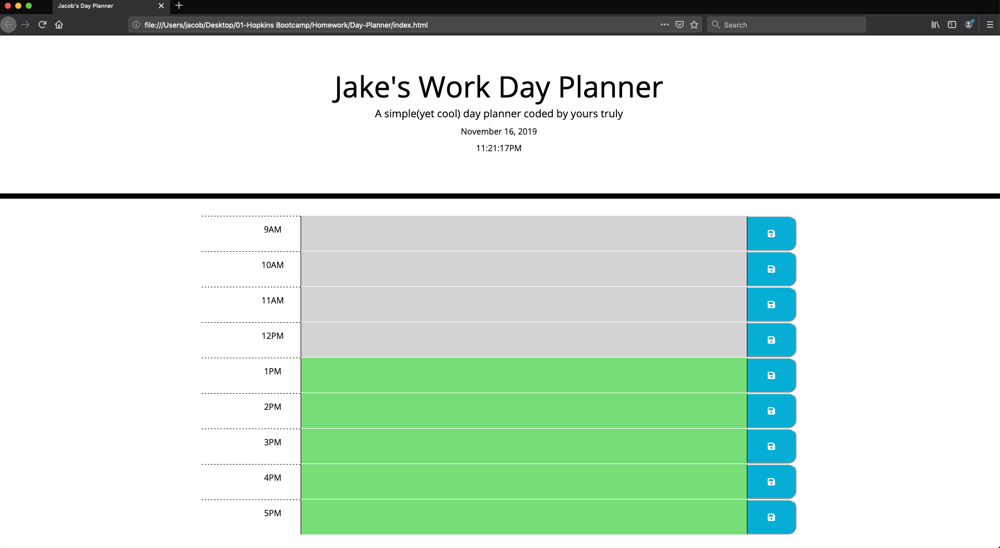
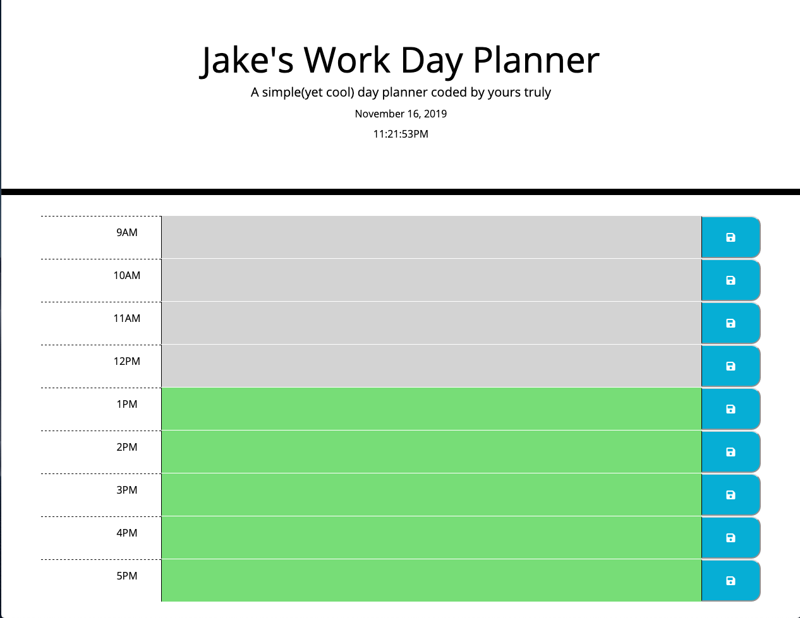
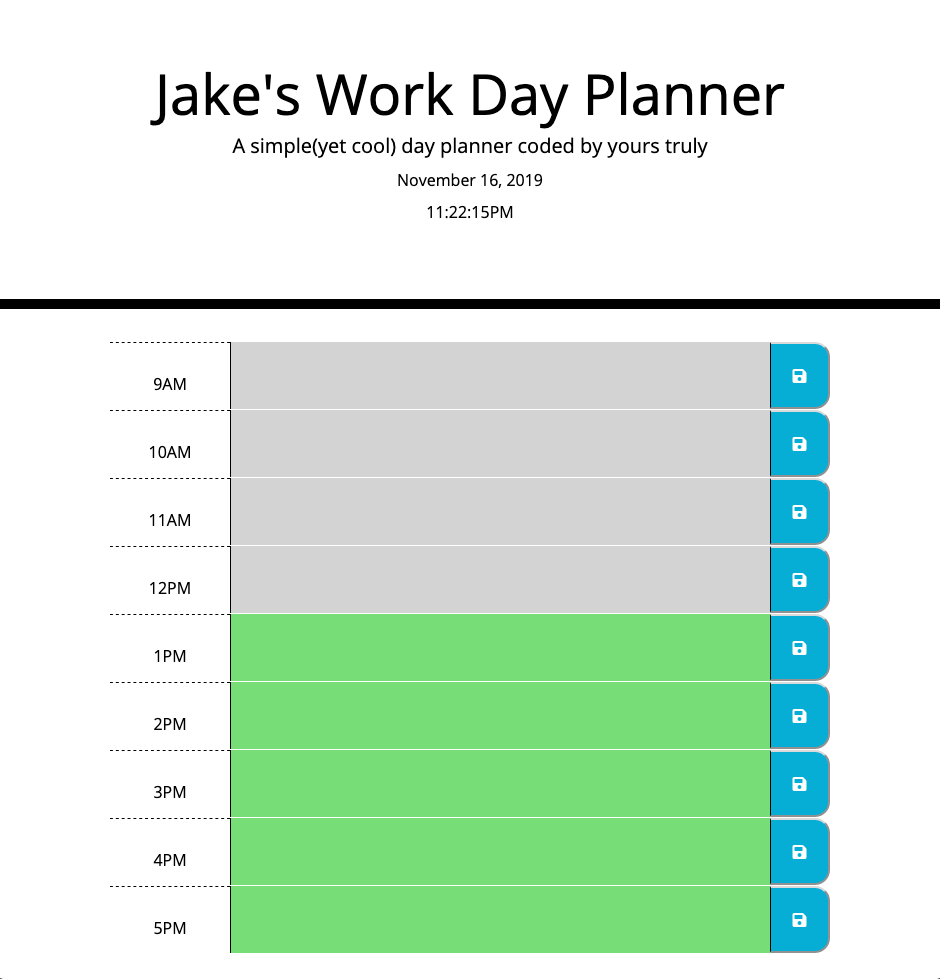
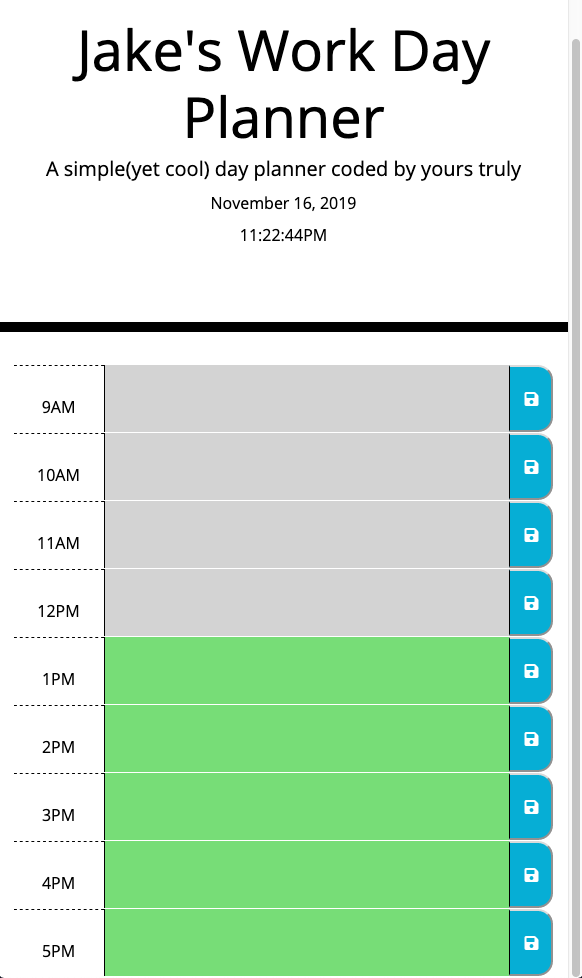

# Day Planner Applications

## About
* The purpose of this application is to create a day planner that a user may use in order to organize and structure their day to day events, thus allowing them to optimize their use of time. 

## Installation

* In order to run this application navigate to the following link [github pages](https://JEmnetu.github.io/Day-Planner)

## Usage 

* To add an event to the planner, enter the event into the textbox that corresponds with the desired time. The application is constantly pulling the current time from the moment.js library, and displays it at the top of the page, and is color coded to display if an event has passed, is currently happening, or is in the future.

* Clicking  on the blue save button will save the entry for its corresponding textbox, until it is replaced by the user. 

## Credits

* The following third party assets were used in the production of this application:

* Bootstrap CSS Framework -[Bootstrap]( https://getbootstrap.com/)
* jQuery Javascript Library - [jQuery](https://jquery.com/)
* Moment.js Javascript Library - [Moment.js](https://momentjs.com/)

## License

This application is licensed under the GNU General Public License. The license can be found in the root directory of this project.

